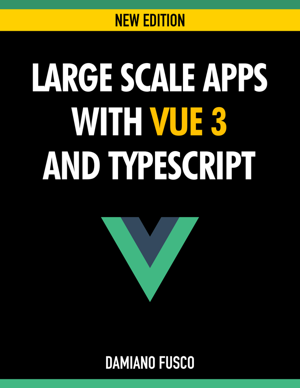
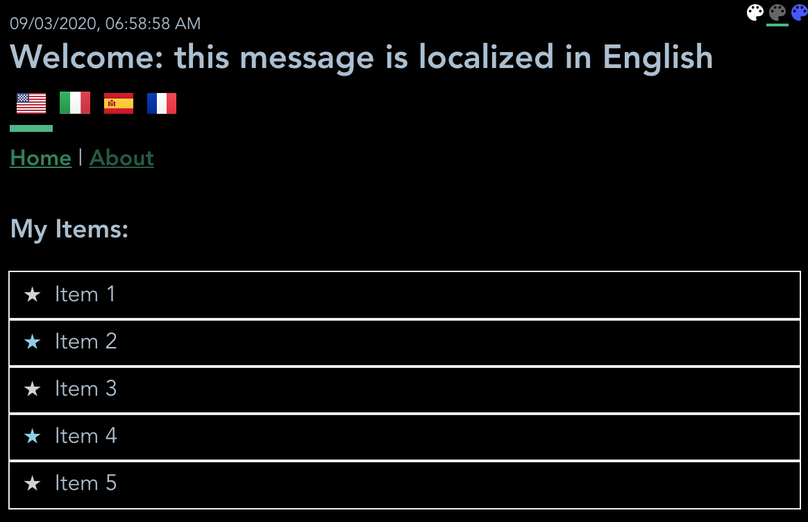

### Companion code for the book:
 

[Large Scale Apps with Vue 3 and TypeScript](
https://vuetypescript.com/?ref=gitrepo "Large Scale Apps with Vue 3 and TypeScript")

### Running Samples:
(Note: these are costantly updated as more chapters are added to the book)
[www.largescaleapps.com](
http://www.largescaleapps.com "www.largescaleapps.com")

### Screenshot as of Chapter 15


### Note
This folder contains the sample project using the Vue 3 composition API coding style.

## Project setup
```
npm install
```

### Compiles and hot-reloads for development
```
npm run serve
```

### Compiles and minifies for production
```
npm run build
```

### Run your unit tests
```
npm run test:unit
```

### Customize configuration
See [Configuration Reference](https://cli.vuejs.org/config/).


